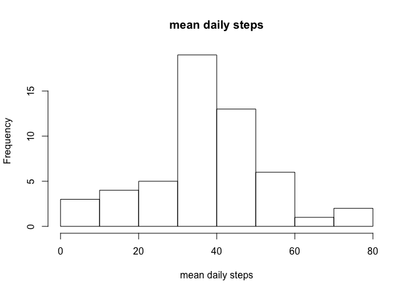
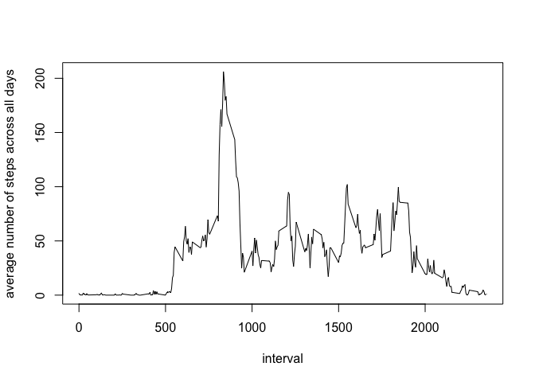
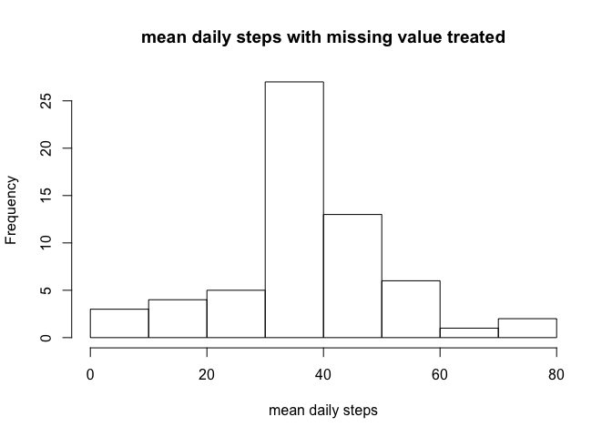
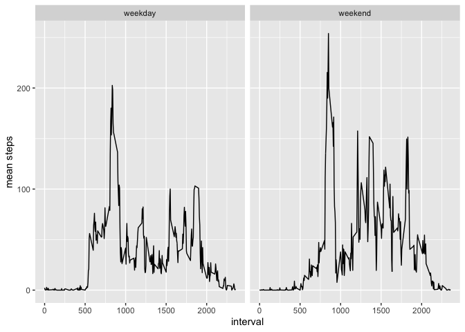

## Loading and preprocessing the data

```r
activity <- read.csv("activity.csv", header = T)
```

## What is mean total number of steps taken per day?

```r
mean_steps <- aggregate(activity[, 1], list(activity$date), mean)
hist(mean_steps$x,  xlab = "mean daily steps", main = "mean daily steps")
```

<!-- -->

```r
summary(mean_steps$x)
```

```
##    Min. 1st Qu.  Median    Mean 3rd Qu.    Max.    NA's 
##  0.1424 30.6979 37.3785 37.3826 46.1597 73.5903       8
```

```r
# median is 37.3785 and mean is 37.3826
```


## What is the average daily activity pattern?

```r
mean_steps_interval <- aggregate(activity[, 1], list(activity$interval), mean, na.rm = T)
plot(mean_steps_interval, type = "l", xlab = "interval", ylab = "average number of steps across all days")
```

<!-- -->

```r
mean_steps_interval$Group.1[which(mean_steps_interval$x == max(mean_steps_interval$x))]
```

```
## [1] 835
```

## Imputing missing values

```r
sum(is.na(activity))
```

```
## [1] 2304
```


```r
# The strategy I'm taking is to fill in the missing value with average steps taken in that interval across all the days with valid values

activity_copy <- activity
for (i in 1:length(activity_copy$steps)){
    if (is.na(activity_copy$steps[i]) == T){
        activity_copy$steps[i] <- mean_steps_interval$x[which(mean_steps_interval$Group.1 == activity_copy$interval[i])]
    } else {
        next
    }
}
```


```r
mean_steps_new <- aggregate(activity_copy[, 1], list(activity_copy$date), mean)
hist(mean_steps_new$x, main = "mean daily steps with missing value treated", xlab = "mean daily steps")
```

<!-- -->

```r
summary(mean_steps_new$x)
```

```
##    Min. 1st Qu.  Median    Mean 3rd Qu.    Max. 
##  0.1424 34.0938 37.3826 37.3826 44.4826 73.5903
```

```r
# median is 37.3826, mean is 37.3826
# median is different while mean is the same
# imputing missing value makes the data less skewed and more centered around the mean
```

## Are there differences in activity patterns between weekdays and weekends?

```r
library(lubridate)
```

```
## 
## Attaching package: 'lubridate'
```

```
## The following object is masked from 'package:base':
## 
##     date
```

```r
activity_copy$week <- ifelse(wday(activity_copy$date) %in% c(6,7), "weekend", "weekday")
mean_steps_week_interval <- aggregate(activity_copy[, 1], list(activity_copy$week, activity_copy$interval), mean)

library(ggplot2)
ggplot(mean_steps_week_interval, aes(x = Group.2, y = x)) + 
    geom_line() + 
    facet_wrap(Group.1~.) + 
    xlab("interval") + 
    ylab("mean steps")
```

<!-- -->


